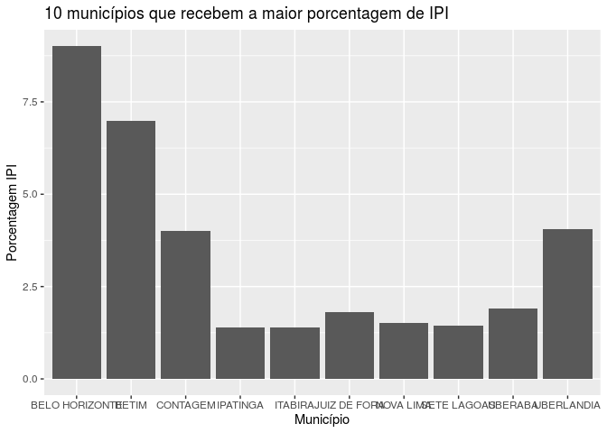
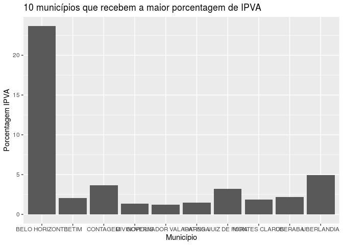
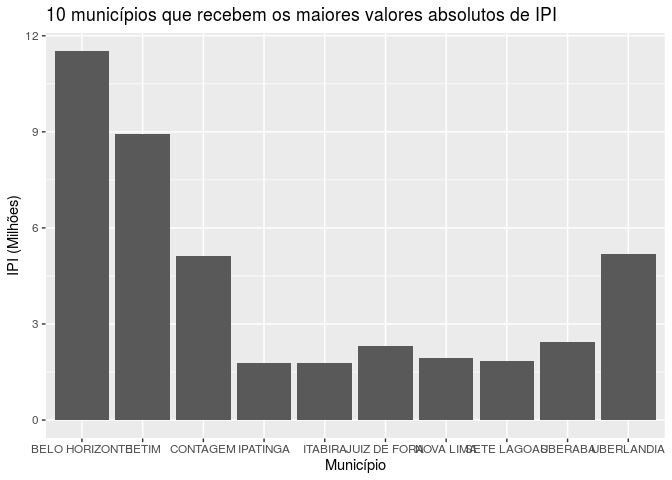
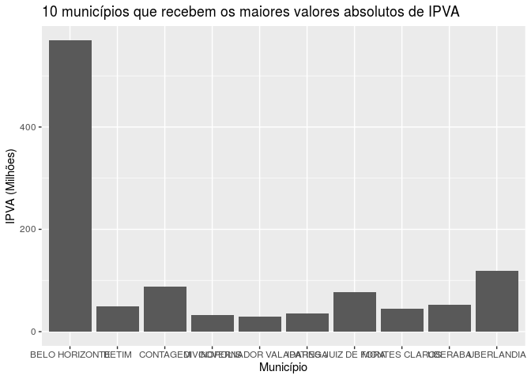
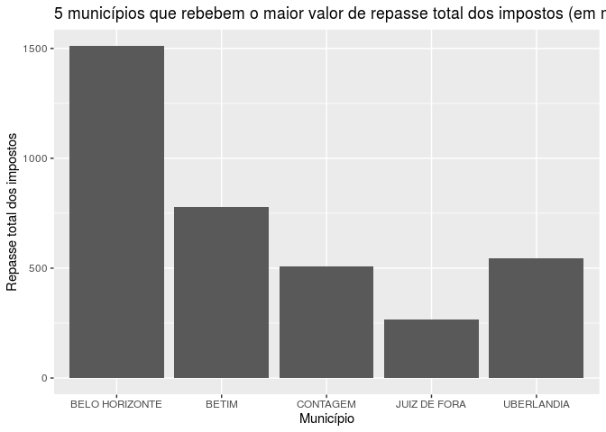
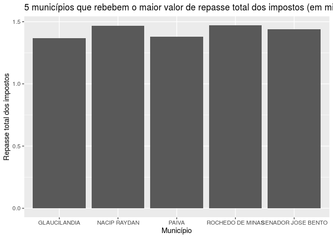
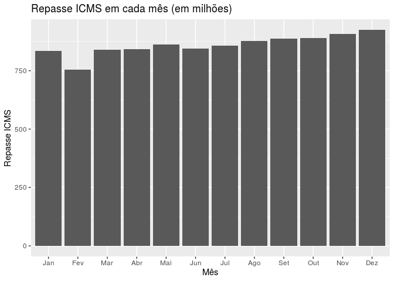
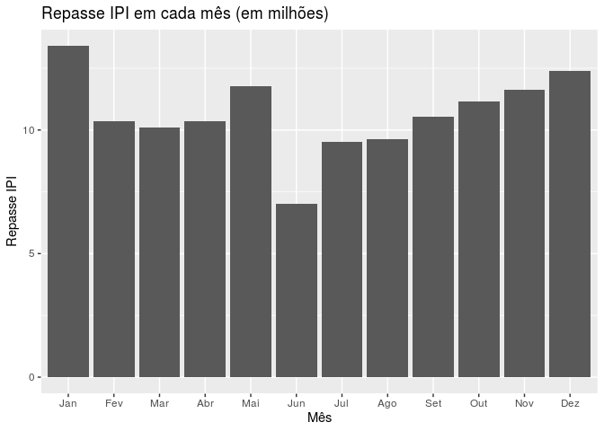
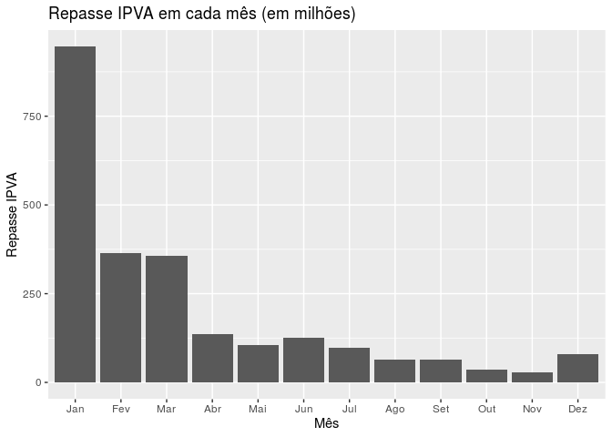
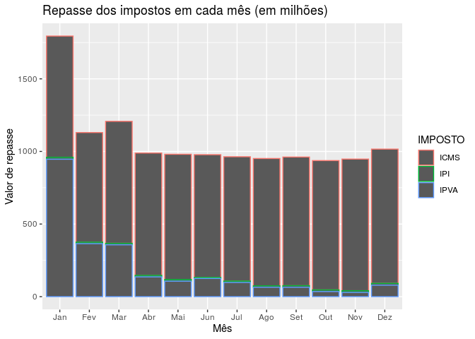

Trabalho final
================
Grupo 7
19/07/2020

## Introdução

##### A base de dados escolhida para a realização da análise exploratória referente ao Trabaho final dessa discplina foi sobre os Repasses a municípios e pode ser acessada nessa [página](http://www.transparencia.dadosabertos.mg.gov.br/dataset/repasse-a-municipios-2015-2016)

Essa base de dado possui as seguintes informações: dados sobre repasse
do Estado aos municípios em relação aos tributos ICMS, IPI e IPVA.
Trata-se do repasse líquido, a que cada município tem direito
descontando-se outras contribuições legais e constitucionais de cada um.
Retrata o repasse publicado em portarias mensais da Secretaria de Estado
da Fazenda.

Na primeira fase do trabaçho final deve ser feita a importação da base
que será utilziada e as perguntas que nortearão a análise exporatória.

### Perguntas

1.  Quais são os 10 municípios que recebem a maior porcentagem de
    repasses do **ICMS**?
2.  Quais são os 10 municípios que recebem a maior porcentagem de
    repasses do **IPI**?
3.  Quais são os 10 municípios que recebem a maior porcentagem de
    repasses do **IPVA**?
4.  Quais são os valores absolutos referentes aos 10 maiores repasses de
    **ICMS** e quais são elas?
5.  Quais são os valores absolutos referentes aos 10 maiores repasses de
    **IPI** e quais são elas?
6.  Quais são os valores absolutos referentes aos 10 maiores repasses de
    **IPVA** e quais são elas?
7.  Quais são os 5 municípios que recebem o **maior** repasse total
    (ICMS+IPI+IPVA)?
8.  Quais são os 5 municípios que recebem o **menor** repasse total
    (ICMS+IPI+IPVA)?
9.  Quanto foi o repasse total de ICMS em cada **mês de 2016**?
10. Quanto foi o repasse total de IPI em cada **mês de 2016**?
11. Quanto foi o repasse total de IPVA em cada **mês de 2016**?

## Análise dos dados

1.  Quais são os 10 municípios que recebem a maior porcentagem de
    repasses do **ICMS**?

<!-- -->

2.  Quais são os 10 municípios que recebem a maior porcentagem de
    repasses do **IPI**?

<!-- -->

3.  Quais são os 10 municípios que recebem a maior porcentagem de
    repasses do **IPVA**?
    <!-- -->

4.  Quais são os valores absolutos referentes aos 10 maiores repasses de
    **ICMS** e quais são elas?

<!-- -->

5.  Quais são os valores absolutos referentes aos 10 maiores repasses de
    **IPI** e quais são elas?

<!-- -->

6.  Quais são os valores absolutos referentes aos 10 maiores repasses de
    **IPVA** e quais são elas?

<!-- -->

7.  Quais são os 5 municípios que recebem o **maior** repasse total
    (ICMS+IPI+IPVA)?

<!-- -->

8.  Quais são os 5 municípios que recebem o **menor** repasse total
    (ICMS+IPI+IPVA)?

<!-- -->

9.  Quanto foi o repasse total de ICMS em cada **mês de 2016**?

<!-- -->

10. Quanto foi o repasse total de IPI em cada **mês de 2016**?

<!-- -->

11. Quanto foi o repasse total de IPVA em cada **mês de 2016**?

<!-- -->

<!-- -->
